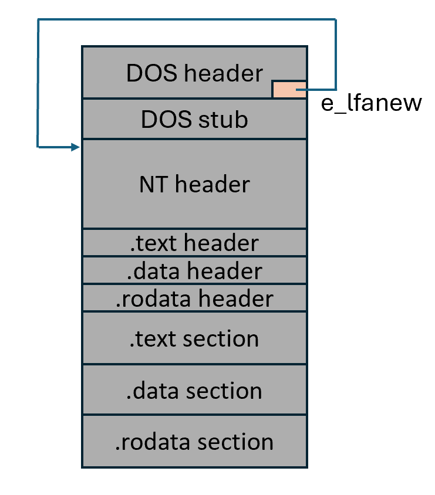
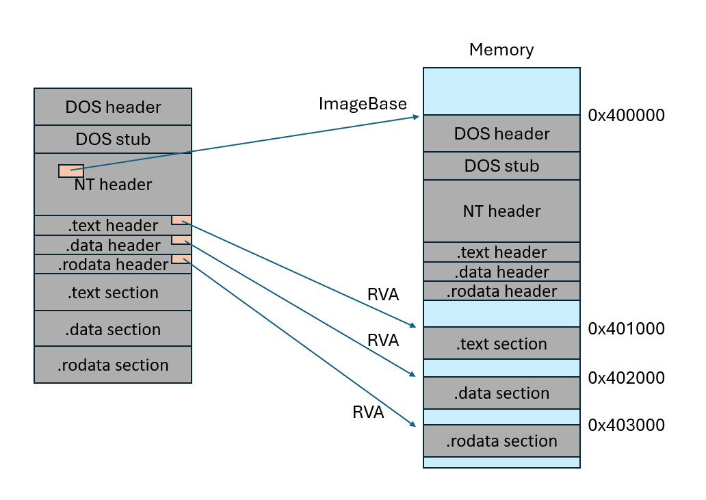
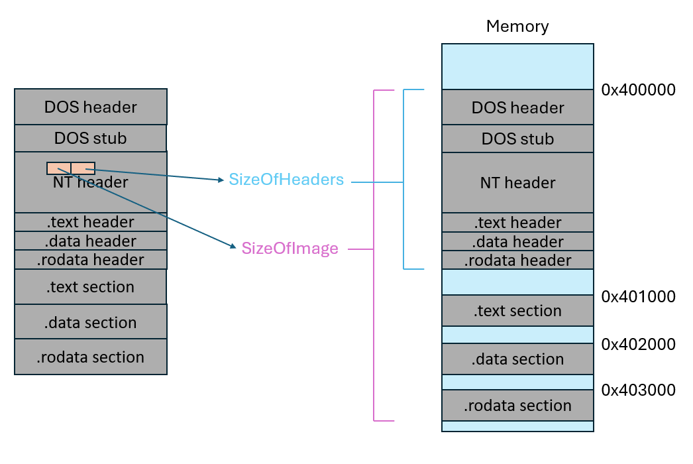
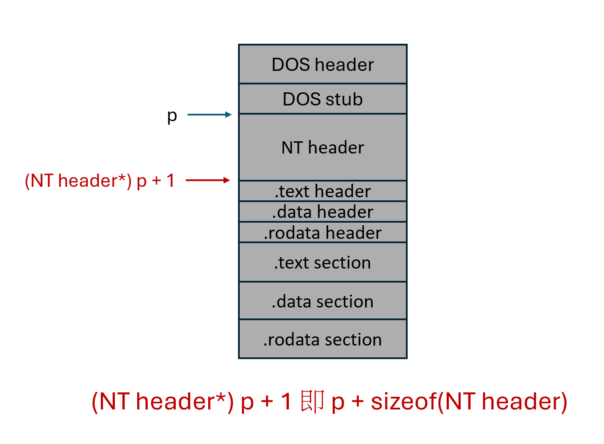
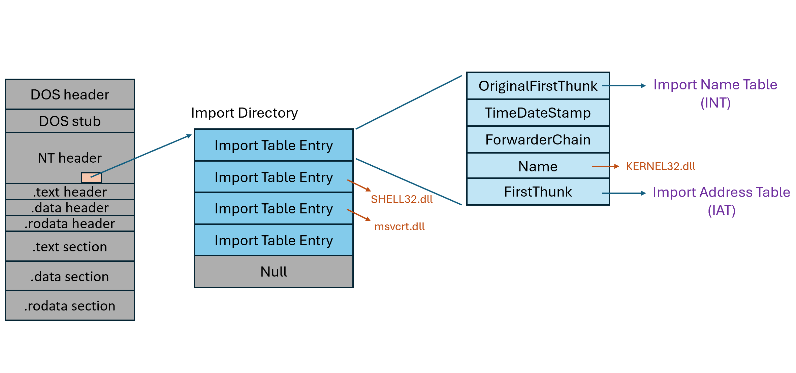
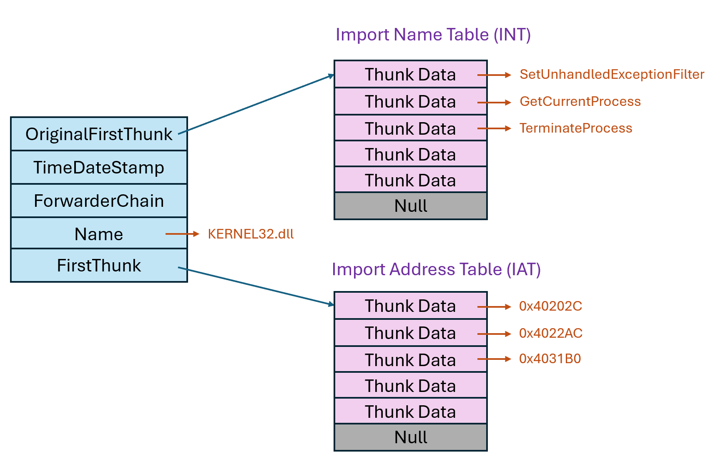
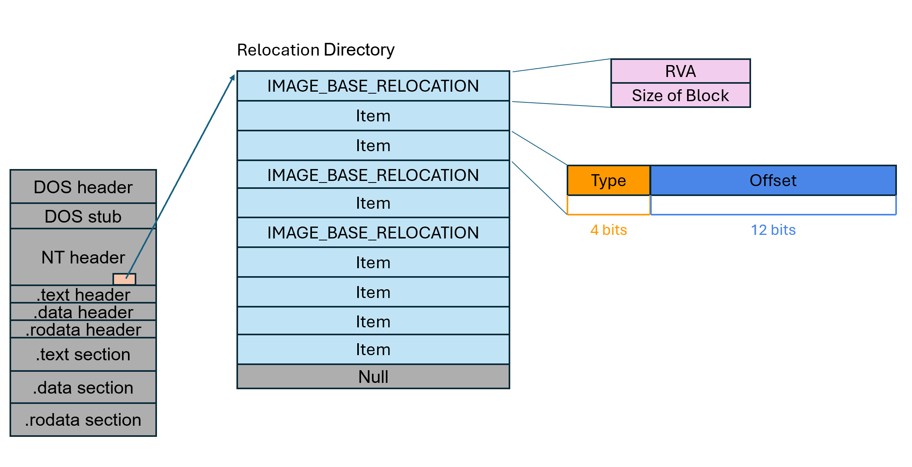
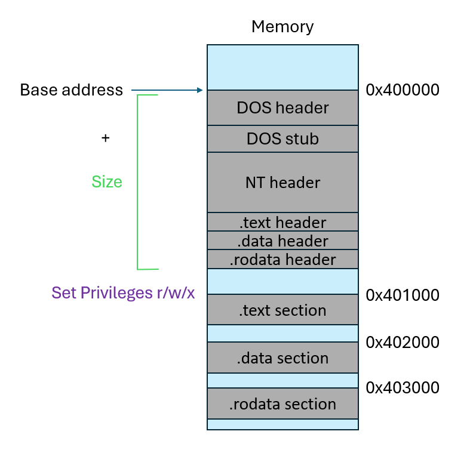
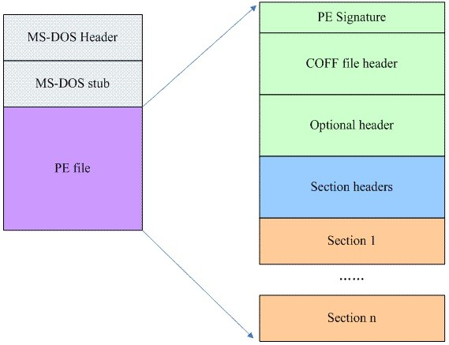
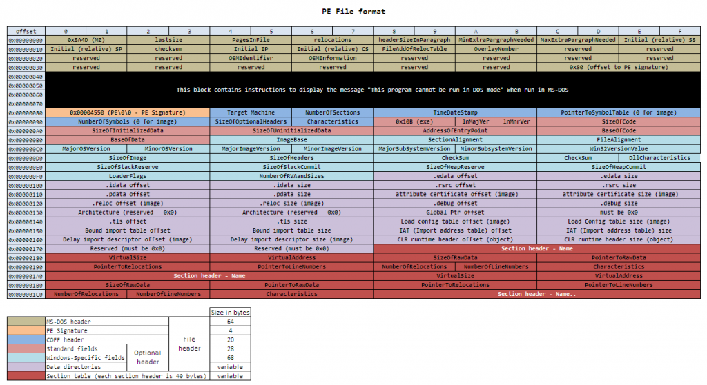

# x86 Program Loader 實作

## 介紹

以 C 語言手刻 32 位元程式載入器 (Program Loader)，了解執行檔載入至記憶體執行過程的原理。

## 使用方式

以 32 位元編譯

```shell
gcc -m32 loader.c -o loader.exe
```

載入 32 位元版本小算盤

```shell
.\loader.exe C:\Windows\SysWOW64\calc.exe
```

## 實作步驟

### 1. 把檔案內容放到記憶體

取得 NT header



取得 PE 的 image base



取得資料大小資料



取得 Section header: 指標 p 指向 NT header 起始位置，將指標轉型成為 NT header 結構指標，此時對其進行 +1 操作即可指到接在 NT header 後面的首個 section header 結構



### 2. 處理動態載入函式庫

#### 儲存 Import 資訊的結構如下

Import Directory (Table Entry 實際結構為 IMAGE_IMPORT_DESCRIPTOR)



IAT 及 INT (Thunk Data 實際結構為 IMAGE_THUNK_DATA，其實就是一個 32/64 bits 的空間，可以當作函數序號、函數名字串起始位置、或是函數實際記憶體位置)



#### Import 資訊運作方式

INT 和 IAT 在最初始載入時，兩個內容是相同的，直到經過 Import 處理後，將 DLL 載入至記憶體，才會將 IAT table 的內容換成實際函數位置。

### 3. 處理重定位

#### 儲存 Relocation 資訊的結構如下



### 4. 設定區段權限

示意圖



### 5. 將程式執行流程指向 Entry Point

```C
return (void*)(ImageBase + entry_point_RVA);
```

## PE 格式參考

PE 格式圖



PE 格式欄位圖


