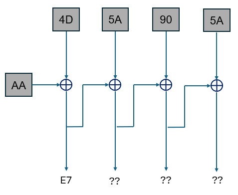
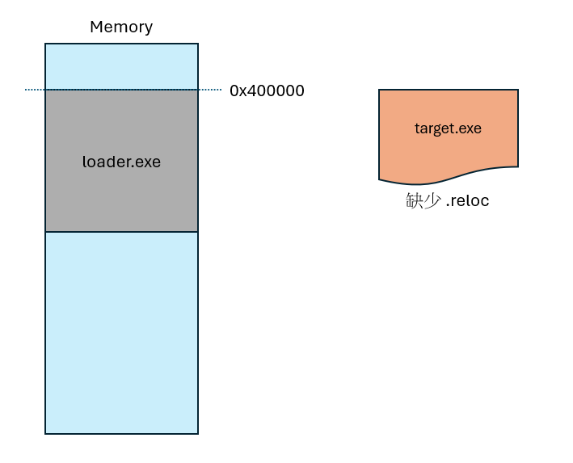
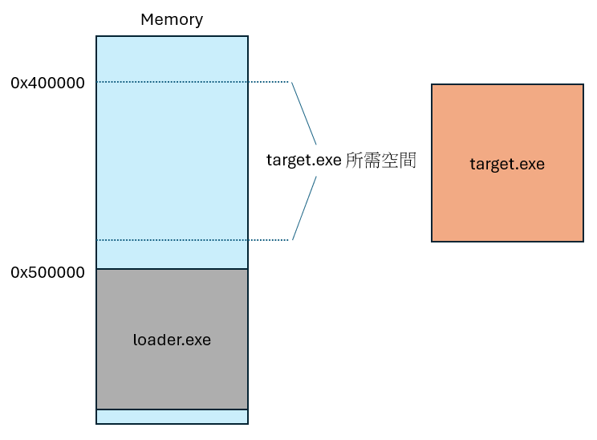
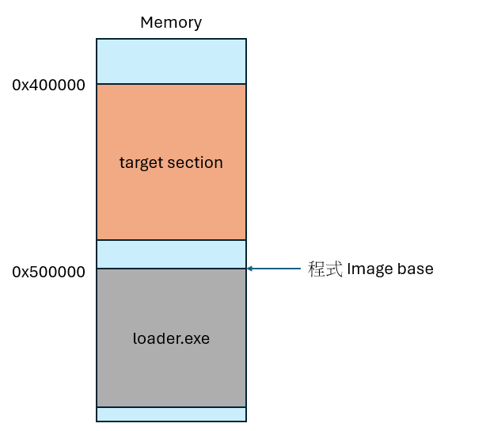

# x86 Packer 實作

## 介紹

學習過程式載入器 (Program Loader) 原理後，以 C 語言手刻 32 位元程式加殼器 (Packer)，了解執行檔加殼的原理。

## 原理

完成 stub，最小化、輕量化編譯過後的 stub 檔案，每次加殼原理即為將目標程式混淆後放入該 stub 的一個 section，加完殼的程式每次使用者執行時，即會先執行 stub 部分，取出該 section 內容解混淆，再將解混淆內容載入至記憶體執行。

## 檔案

`unpack_stub.c`: 用於實作加殼程式的自解殼 stub 程式
`packer.py`: 用於將 x86 執行檔加殼的加殼器程式

## 使用方式

編譯 stub

```shell
gcc -m32 unpack_stub.c -o unpack_stub.exe "-Wl,--entry=__start" -nostartfiles -nostdlib -fno-ident -fno-asynchronous-unwind-tables -lkernel32
```

對 32 位元小算盤加殼

```shell
python .\packer.py C:\Windows\SysWOW64\calc.exe -o packed_calc.exe
```

## 實作步驟

### 1. Stub 部分

以 CBC 模式進行混淆



編譯指令解釋如下

- `-nostartfiles` : 告訴 GCC 不要包含標準的啟動文件（startup files），啟動文件是一些預編譯的代碼，負責初始化 C 運行時環境，包括設置 stack/heap、初始化全域變數、調用 main 函數等。
- `-nostdlib` : 告訴 GCC 不要連接標準庫。
- `-fno-ident` : 告訴 GCC 不要在生成的可執行文件中包含編譯器識別信息，因為默認情況下會在目標文件中嵌入一個 `.ident` section，其中包含編譯器的版本信息。
- `-fno-asynchronous-unwind-tables` : 告訴 GCC 不要生成異步展開表（asynchronous unwind tables）。
- `-lkernel32` : 由於沒有連結 C 標準庫，無法使用一些標準功能，因此需要依賴連結 `kernel32`。

### 2. Packer 部分

並非每個 exe 載入至記憶體時都需要重定位資訊，因此這個部分需要特別處理遇到要加殼的程式為缺少重定位資訊的 exe 檔，解決方式為: 改變 loader 自身的 image base 位址，讓出位址來讓目標 exe 載入。






